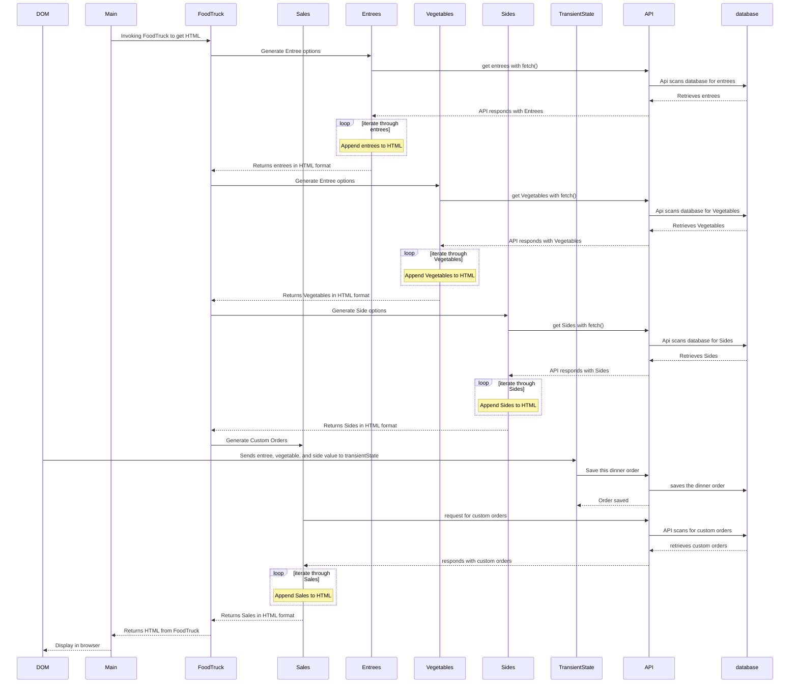

```mermaid
sequenceDiagram

    Participant DOM
    Participant Main
    Participant FoodTruck
    Participant Sales
    Participant Entrees
    Participant Vegetables
    Participant Sides
    Participant TransientState
    Participant API
    Participant database

    Main->>FoodTruck: Invoking FoodTruck to get HTML
    FoodTruck->>Entrees: Generate Entree options
    Entrees->>API: get entrees with fetch()
    API->>database: Api scans database for entrees
    database-->>API: Retrieves entrees
    API-->>Entrees: API responds with Entrees
    
    loop iterate through entrees
        note over Entrees: Append entrees to HTML
    end
    
    Entrees-->>FoodTruck: Returns entrees in HTML format
    
    FoodTruck->>Vegetables: Generate Entree options
    Vegetables->>API: get Vegetables with fetch()
    API->>database: Api scans database for Vegetables
    database-->>API: Retrieves Vegetables
    API-->>Vegetables: API responds with Vegetables
    
    loop iterate through Vegetables
        note over Vegetables: Append Vegetables to HTML
    end
    
    Vegetables-->>FoodTruck: Returns Vegetables in HTML format

    FoodTruck->>Sides: Generate Side options
    Sides->>API: get Sides with fetch()
    API->>database: Api scans database for Sides
    database-->>API: Retrieves Sides
    API-->>Sides: API responds with Sides
    
    loop iterate through Sides
        note over Sides: Append Sides to HTML
    end
    
    Sides-->>FoodTruck: Returns Sides in HTML format
    FoodTruck->>Sales: Generate Custom Orders

    DOM->>TransientState: Sends entree, vegetable, and side value to transientState
    TransientState->>API: Save this dinner order
    API->>database: saves the dinner order
    API-->>TransientState: Order saved
    Sales->>API: request for custom orders
    API->>database: API scans for custom orders
    database-->>API: retrieves custom orders
    API-->>Sales: responds with custom orders

    loop iterate through Sales
        note over Sales: Append Sales to HTML
    end
    
    Sales-->>FoodTruck: Returns Sales in HTML format

    FoodTruck-->>Main: Returns HTML from FoodTruck
    Main-->>DOM: Display in browser

```